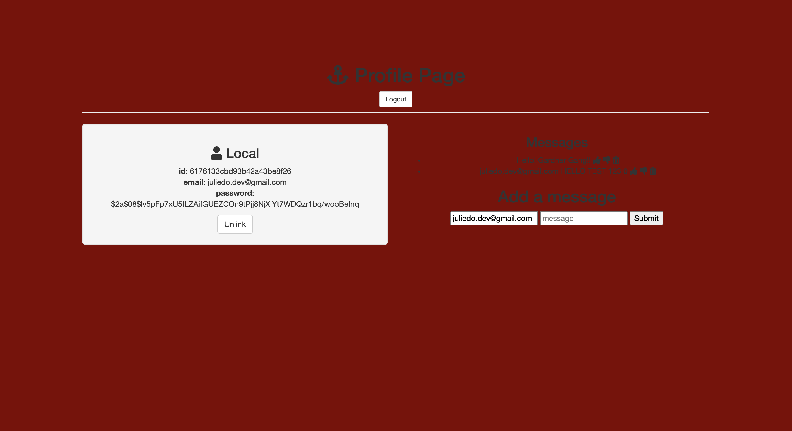

This is a full stack application with authentication where the user can write messages on a message board. Others can also like and dislike messages.
Link to Project: [https://juliedodev-savageauth.netlify.app/]

How It's Made:

Tech Used: EJS, CSS, JavaScript, Node.js, Express.js and MongoDB.

Optimizations: 

Lesson Learned: I learned how to use CRUD functions and stored data in MongoDB. 

